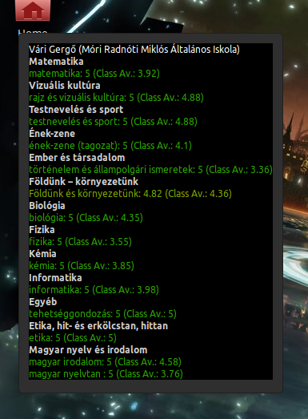

# eKreta@thegergo02

## Features
* Automated data reload
* Displaying your subject averages
  * Grouping by subject categories,
  * Coloring your subject by their average (+ Customise the grade ranges),
  * Displaying class averages,
  * Compare your averages to class averages.

## Coming Features
* When changing settings, you don't need to reload the desklet.
* Better UI
* Tabs
  * Display everything it can fetch from the KRETA servers.
* Translate to other languages (especially to Hungarian)

## Screenshot

