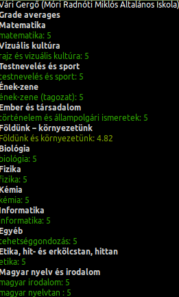
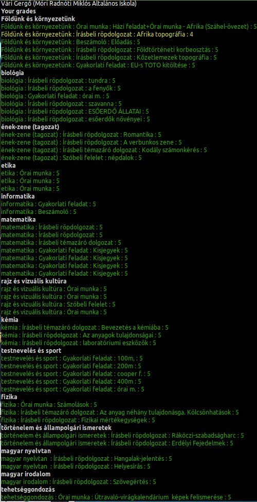

# eKreta@thegergo02

  

## Funkciók
* Automatikus adat lekérés
* A beállítások megváltoztatása után nem kell a deskletet újratölteni.  
* Tantárgy átlagok kijelzése
  * Tantárgy kategóriák által való csoportosítás,
  * Tantárgyak kiszínezése átlag alapján (+ Az osztályzatok tartományának testreszabása),
  * Osztály átlag megjelenítése,
  * A te és az osztályod átlagának összehasonlítása.  

* A jegyeid kijelzése
  * Csoportosítás tantárgyak szerint,
  * A jegyeid színezése értékük alapján,
  * Minden információ megjelenítése a jegyeidről.  

  
## Fejlesztésben lévő funkciók
* Új kinézet
* Fülek
  * Minden adat kijelzése az KRETA szerverekről. (Hiányzások,jegyzetek,órarend...)
* Más nyelvekre való fordítás (Főleg magyarra...)

## Changelog

### v0.0.1 (Alpha)
* Első kiadás! :+1:
* Tantárgyak átlagának kijelzése
* A kód refactorolva
* Mainloop implementálva
